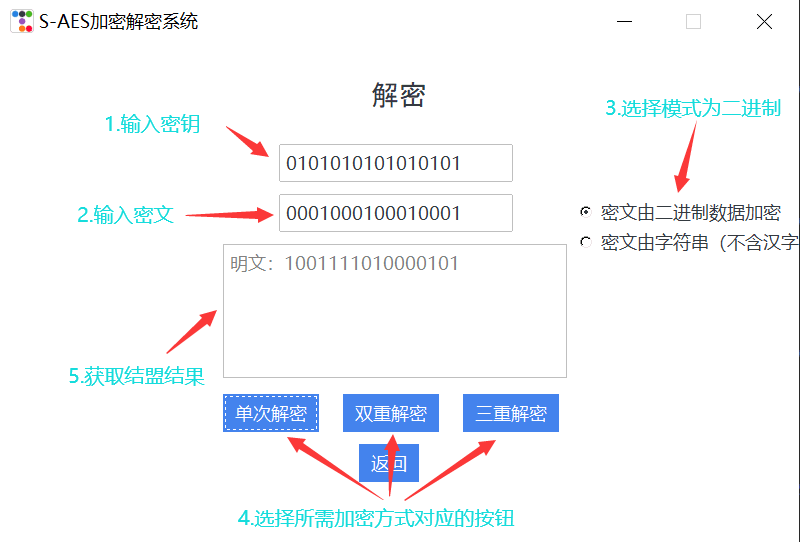
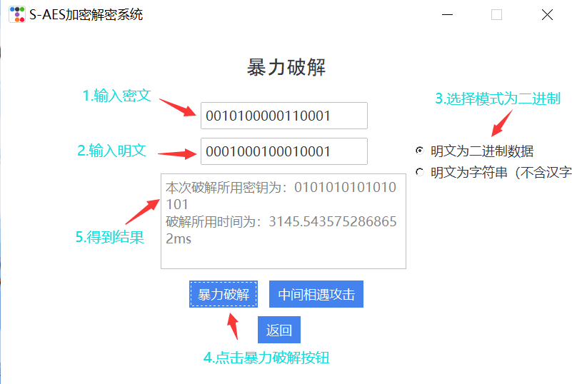
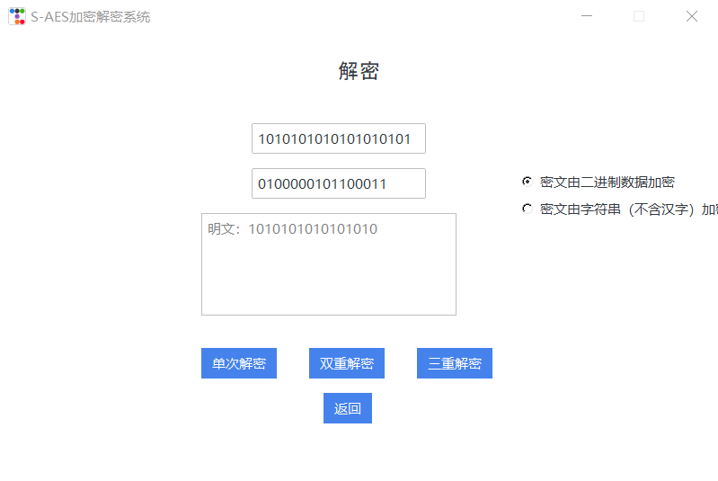

# encryption
## 作业详情
### 开发手册
#### 1.项目运行环境

本项目依赖以下环境：

- python 3.1.13
- 第三方库 ttkbootstrap, chardet, numpy
- windows 10 系统

#### 2.算法实现

##### 2.1密钥扩展

创建密钥生成函数 首先获取随机初始16位密钥，在调用密钥扩展函数获得子密钥

    # 生成16位随机密钥
    def create_key(self) -> str:
        str_key = ""
        for i in range(16):
            key = random.randint(0, 1)
            str_key += str(key)
        return str(str_key)

    # 获取密钥拓展每一轮的密钥
    def get_extend_key(self, input_key, num) -> str:
        input_key = self.change_16to2(input_key)
        temp_left = input_key[:8]
        temp_right = input_key[8:]
        temp_right_left = temp_right[:4]
        temp_right_right = temp_right[4:]
        temp = (str(hex(self.S_box[int(temp_right_right[:2], 2)][int(temp_right_right[2:], 2)])[-1])
                + str(hex(self.S_box[int(temp_right_left[:2], 2)][int(temp_right_left[2:], 2)]))[-1])
        if num == 0:
            key_left = int(temp_left, 2) ^ int('10000000', 2) ^ int(temp, 16)
        else:
            key_left = int(temp_left, 2) ^ int('00110000', 2) ^ int(temp, 16)
        key_right = str(hex(key_left ^ int(temp_right, 2))[2:])
        key_left = str(hex(key_left)[2:])
        return key_left.zfill(2) + key_right.zfill(2)

    # 密钥拓展
    def key_extend(self, input_key) -> list[str]:
        key_one = self.get_extend_key(input_key, 0)
        key_two = self.get_extend_key(key_one, 1)

        return [key_one, key_two]

##### 2.2 伽罗华域运算
实现伽罗华域的加减乘除运算，用于接下来加密过程的列混淆

        # 伽罗华域
        primitive_polynomial_dict = {4: 0b10011,  # x**4  + x  + 1
                                 8: (1 << 8) + 0b11101,  # x**8  + x**4  + x**3 + x**2 + 1
                                 16: (1 << 16) + (1 << 12) + 0b1011,  # x**16 + x**12 + x**3 + x + 1
                                 32: (1 << 32) + (1 << 22) + 0b111,  # x**32 + x**22 + x**2 + x + 1
                                 64: (1 << 64) + 0b11011  # x**64 + x**4 + x**3 + x + 1
                                 }
        
        
        class GF:
        def __init__(self, w):
            self.w = w
            self.total = (1 << self.w) - 1
            self.gflog = []
            self.gfilog = [1]  # g(0) = 1
            self.make_gf_dict(self.w, self.gflog, self.gfilog)
        
        def make_gf_dict(self, w, gflog, gfilog):
            gf_element_total_number = 1 << w
            primitive_polynomial = primitive_polynomial_dict[w]
            for i in range(1, gf_element_total_number - 1):
                temp = gfilog[i - 1] << 1  # g(i) = g(i-1) * 2
                if temp & gf_element_total_number:  # 判断溢出
                    temp ^= primitive_polynomial  # 异或本原多项式
                gfilog.append(temp)
        
            assert (gfilog[gf_element_total_number - 2] << 1) ^ primitive_polynomial
            gfilog.append(None)
        
            for i in range(gf_element_total_number):
                gflog.append(None)
        
            for i in range(0, gf_element_total_number - 1):
                gflog[gfilog[i]] = i
        
        def add(self, a, b):
            return a ^ b
        
        def sub(self, a, b):
            return (a ^ b) % self.total
        
        def mul(self, a, b):
            if a == 0 or b == 0:
                return 0
            else:
                return self.gfilog[(self.gflog[a] + self.gflog[b]) % self.total]
        
        def div(self, a, b):
            return self.gfilog[(self.gflog[a] - self.gflog[b]) % self.total]

##### 2.3 加密函数

2.3.1 针对16bits数据的输入加密

    # 16bit加密
    def encrypt(self, plain_text, secret_key):
        if len(plain_text) != 4:
            plain_text = self.binary_to_hex(plain_text)
        if len(secret_key) != 4:
            secret_key = self.binary_to_hex(secret_key)
        # 明文轮密钥加
        temp = self.key_xor(secret_key, plain_text)
        # 获取第一轮和第二轮的拓展密钥
        keys = self.key_extend(secret_key)
        # 第一轮
        temp = self.replace_res(temp)
        temp = self.move_row(temp)
        temp = self.col_mix(temp)
        temp = self.key_xor(keys[0], self.change_cov_to_str(temp))
        # 第二轮
        temp = self.replace_res(temp)
        temp = self.move_row(temp)
        temp = self.key_xor(keys[1], self.change_cov_to_str(temp))
        secret_text = self.change_16to2(self.change_cov_to_str(temp))
        return secret_text
    
    # 密钥加
    def key_xor(self, key, p) -> list[str]:
        res = []
        for i in range(4):
            temp_key = int(key[i], 16)
            temp_p = int(p[i], 16)
            temp = str(temp_key ^ temp_p)
            res.append(temp)
        res = np.array(res)
        return res.reshape(-1, 2)

    # 16进制补齐4位函数
    def add_4(self, str_temp) -> str:
        res = ''
        epch = 4 - len(str_temp)
        for i in range(epch):
            res += '0'
        return res + str_temp

    # 半字节替代
    def replace_res(self, input_res):
        res = []
        for i in range(2):
            for j in range(2):
                temp = int(input_res[i][j])
                # 获取二进制字符串
                str_temp = str(bin(temp)[2:])
                if len(str_temp) < 4:
                    str_temp = self.add_4(str_temp)
                # 获取二进制字符串前两位和后两位
                row = str_temp[:2]
                clo = str_temp[2:]
                res.append(str(self.S_box[int(row, 2)][int(clo, 2)]))
        res = np.array(res)
        return res.reshape(-1, 2)

    # 行位移
    def move_row(self, input_res) -> list[str]:
        temp = input_res[0][1]
        input_res[0][1] = input_res[1][1]
        input_res[1][1] = temp
        return input_res

    # 列混淆
    def col_mix(self, input_res):
        input_res = [[int(cell) for cell in row] for row in input_res]
        input_res = np.array(input_res).T
        gf = GF(4)
        element1 = gf.add(gf.mul(self.mix_box[0], input_res[0][0]), gf.mul(self.mix_box[1], input_res[1][0]))
        element2 = gf.add(gf.mul(self.mix_box[0], input_res[0][1]), gf.mul(self.mix_box[1], input_res[1][1]))
        element3 = gf.add(gf.mul(self.mix_box[2], input_res[0][0]), gf.mul(self.mix_box[3], input_res[1][0]))
        element4 = gf.add(gf.mul(self.mix_box[2], input_res[0][1]), gf.mul(self.mix_box[3], input_res[1][1]))
        return [[element1, element3], [element2, element4]]

    # 将十六进制变成二进制
    def change_16to2(self, input_str):
        res = ''
        for i in range(len(input_str)):
            temp = int(input_str[i], 16)
            str_temp = str(bin(temp)[2:])
            if len(str_temp) < 4:
                str_temp = self.add_4(str_temp)
            res += str_temp
        return res

2.3.2 针对字符串的输入加密
通过函数将字符串中每两个转化为16bits的二进制串，再进行分别独立的解密，最后变成一个解密后的二进制串的元组，每一位为16bits的二进制串。再通过函数将其转变为字符串。

    # 字符串的加密函数
    def str_encrypt(self, plain_text, secret_key):
        if len(secret_key) != 4:
            secret_key = self.binary_to_hex(secret_key)
        str_01_list = self.string_to_binary(plain_text)
        str_01_list = self.cut(str_01_list)
        c_list_2 = []
        for i in range(len(str_01_list) // 2):
            str_temp_2 = str_01_list[i * 2] + str_01_list[i * 2 + 1]
            # 将组合好的二进制字符串变成十六进制字符串
            str_temp_16 = self.binary_to_hex(str_temp_2)
            # 调用加密函数
            res_temp_2 = self.encrypt(str_temp_16, secret_key)
            c_list_2.append(res_temp_2)
        # 将二进制字符串列表变为字母
        res = self.str_to_word(c_list_2)
        return res

    # 将二进制变为16进制
    def binary_to_hex(self, binary_string) -> str:
        decimal = int(binary_string, 2)  # 将二进制变为十进制
        hex_string = hex(decimal)[2:]
        hex_string = self.add_4(hex_string)
        return hex_string

    # 将二进制的字符串数组变成输入的明文字符串
    def str_to_word(self, p_list):
        temp_str = ""
        for i in range(len(p_list)):
            temp_str += p_list[i]
        ascii_string = ''.join(chr(int(temp_str[i:i + 8], 2)) for i in range(0, len(temp_str), 8))
        return ascii_string

##### 2.4 解密函数

2.4.1 针对16bits的解密

    # 16bits解密
    def decrypt(self, secret_text, secret_key):
        if len(secret_text) != 4:
            secret_text = self.binary_to_hex(secret_text)
        if len(secret_key) != 4:
            secret_key = self.binary_to_hex(secret_key)
        # 获取第一轮和第二轮的拓展密钥
        keys = self.key_extend(secret_key)
        # 密文文轮密钥加
        temp = self.key_xor(keys[1], secret_text)
        # 第一轮
        temp = self.move_row(temp)
        temp = self.replace_res_inv(temp)
        temp = self.key_xor(keys[0], self.change_cov_to_str(temp))
        temp = self.col_mix_inv(temp)
        # 第二轮
        temp = self.move_row(temp)
        temp = self.replace_res_inv(temp)
        temp = self.key_xor(secret_key, self.change_cov_to_str(temp))
        plain_text = self.change_16to2(self.change_cov_to_str(temp))
        return plain_text

    # 将矩阵转回16进制字符串
    def change_cov_to_str(self, cov) -> str:
        temp = ''
        for i in cov:
            for j in i:
                temp += str(hex(int(j))[2:])
        return temp

    # 逆半字节替代
    def replace_res_inv(self, input_res):
        res = []
        for i in range(2):
            for j in range(2):
                temp = int(input_res[i][j])
                # 获取二进制字符串
                str_temp = str(bin(temp)[2:])
                if len(str_temp) < 4:
                    str_temp = self.add_4(str_temp)
                # 获取二进制字符串前两位和后两位
                row = str_temp[:2]
                clo = str_temp[2:]
                res.append(str(self.S_box_inv[int(row, 2)][int(clo, 2)]))
        res = np.array(res)
        return res.reshape(-1, 2)

    # 逆列混淆
    def col_mix_inv(self, input_res):
        input_res = [[int(cell) for cell in row] for row in input_res]
        input_res = np.array(input_res).T
        gf = GF(4)
        element1 = gf.add(gf.mul(self.mix_box_inv[0], input_res[0][0]), gf.mul(self.mix_box_inv[1], input_res[1][0]))
        element2 = gf.add(gf.mul(self.mix_box_inv[0], input_res[0][1]), gf.mul(self.mix_box_inv[1], input_res[1][1]))
        element3 = gf.add(gf.mul(self.mix_box_inv[2], input_res[0][0]), gf.mul(self.mix_box_inv[3], input_res[1][0]))
        element4 = gf.add(gf.mul(self.mix_box_inv[2], input_res[0][1]), gf.mul(self.mix_box_inv[3], input_res[1][1]))
        return [[element1, element3], [element2, element4]]

2.4.2 针对字符串的加密

    # 字符串的解密函数
    def str_decrypt(self, secret_text, secret_key):
        if len(secret_key) != 4:
            secret_key = self.binary_to_hex(secret_key)
        str_01_list = self.string_to_binary(secret_text)
        str_01_list = self.cut(str_01_list)
        c_list_2 = []
        for i in range(len(str_01_list) // 2):
            str_temp_2 = str_01_list[i * 2] + str_01_list[i * 2 + 1]
            # 将组合好的二进制字符串变成十六进制字符串
            str_temp_16 = self.binary_to_hex(str_temp_2)
            # 调用加密函数
            res_temp_2 = self.decrypt(str_temp_16, secret_key)
            c_list_2.append(res_temp_2)
        # 将二进制字符串列表变为字母
        res = self.str_to_word(c_list_2)
        return res

##### 2.5 暴力破解函数
我们获得一对明文和密文，遍历16bits密钥，不断尝试，直到获得能将密文解密成明文的密钥，并获取该密钥和破解时间

2.5.1 针对16bits明文的暴力破解

    # 16bits暴力破解
    def brute_force(self, p, c):
        start_time = time.time()  # 获取当前时间
        for i in range(0, 65536):
            binary_str = bin(i)[2:].zfill(16)  # 生成密钥
            binary_str = self.binary_to_hex(binary_str)  # 生成16进制密钥
            ans = self.decrypt(c, binary_str)
            if ans == p:
                end_time = time.time()
                execution_time = end_time - start_time  # 计算两个时间点之间的差异
                return self.change_16to2(binary_str), str(execution_time * 1000)

2.5.2 针对字符串明文的暴力破解

    # 字符串暴力破解
    def str_brute_force(self, p, c):
        start_time = time.time()  # 获取当前时间
        for i in range(0, 65536):
            binary_str = bin(i)[2:].zfill(16)  # 生成密钥
            binary_str = self.binary_to_hex(binary_str)  # 生成16进制密钥
            ans = self.str_decrypt(c, binary_str)
            if ans == p:
                end_time = time.time()
                execution_time = end_time - start_time  # 计算两个时间点之间的差异
                return self.change_16to2(binary_str), str(execution_time * 1000)

##### 2.6 双重加密函数

2.6.1 16bits的双重加密

    # 二进制的双重加密
    def double_encrypt(self, p, key):
        key1 = key[:16]
        key2 = key[16:]
        temp_c1 = self.encrypt(p, key1)
        res = self.encrypt(temp_c1, key2)
        return res

2.6.2 字符串的双重加密

    # 字符串双重加密
    def double_str_encrypt(self, p, key):
        key1 = key[:16]
        key2 = key[16:]
        temp_c1 = self.str_encrypt(p, key1)
        res = self.str_encrypt(temp_c1, key2)
        return res

##### 2.7 双重解密函数

2.7.1 16bits的双重解密

    # 二进制字符串双重解密
    def double_decrypt(self, c, key):
        key1 = key[:16]
        key2 = key[16:]
        temp_p1 = self.decrypt(c, key2)
        res = self.decrypt(temp_p1, key1)
        return res

2.7.1 字符串的双重解密
    
    # 字符串的双重解密
    def double_str_decrypt(self, c, key):
        key1 = key[:16]
        key2 = key[16:]
        temp_p1 = self.str_decrypt(c, key2)
        res = self.str_decrypt(temp_p1, key1)
        return res

##### 2.8 三重加密函数

2.8.1 16bits的三重加密

    # 16bits三重加密
    def triple_encrypt(self, p, key):
        key1 = key[:16]
        key2 = key[16:32]
        key3 = key[32:]
        temp_c1 = self.encrypt(p, key1)
        temp_c2 = self.encrypt(temp_c1, key2)
        res = self.encrypt(temp_c2, key3)
        return res

2.8.2 字符串的三重加密

    # 字符串的三重加密
    def triple_str_encrypt(self, p, key):
        key1 = key[:16]
        key2 = key[16:32]
        key3 = key[32:]
        temp_c1 = self.str_encrypt(p, key1)
        temp_c2 = self.str_encrypt(temp_c1, key2)
        res = self.str_encrypt(temp_c2, key3)
        return res

##### 2.9 三重解密函数

2.9.1 16bits的解密函数

    # 三重解密
    def triple_decrypt(self, c, key):
        key1 = key[: 16]
        key2 = key[16: 32]
        key3 = key[32:]
        temp_p1 = self.decrypt(c, key3)
        temp_p2 = self.decrypt(temp_p1, key2)
        res = self.decrypt(temp_p2, key1)
        return res

2.9.2 字符串的解密函数

    # 字符串三重解密
    def triple_str_decrypt(self, c, key):
        key1 = key[: 16]
        key2 = key[16: 32]
        key3 = key[32:]
        temp_p1 = self.str_decrypt(c, key3)
        temp_p2 = self.str_decrypt(temp_p1, key2)
        res = self.str_decrypt(temp_p2, key1)
        return res

##### 2.10 中间相遇攻击

2.10.1 16bits的中间相遇攻击函数

    # 中间相遇攻击
    def mid_attack(self, p, c):
        c_list = []
        for i in range(0, 65536):
            binary_str_k1 = bin(i)[2:].zfill(16)  # 生成密钥
            binary_str_k1 = self.binary_to_hex(binary_str_k1)  # 生成16进制密钥
            c_list.append(self.encrypt(p, binary_str_k1))
        res = []
        count = 0
        for i in range(0, 65536):
            binary_str_k2 = bin(i)[2:].zfill(16)  # 生成密钥
            binary_str_k2 = self.binary_to_hex(binary_str_k2)  # 生成16进制密钥
            temp_p = self.decrypt(c, binary_str_k2)
            for i in range(len(c_list)):
                if c_list[i] == temp_p:
                    count += 1
                    k1 = bin(i)[2:].zfill(16)
                    k2 = self.change_16to2(binary_str_k2)
                    res.append(k1 + k2)
        return res, count

2.10.2 字符串的中间相遇攻击函数

    # 字符串的中间相遇攻击
    def mid_str_attack(self, p, c):
        c_list = []
        for i in range(0, 65536):
            binary_str_k1 = bin(i)[2:].zfill(16)  # 生成密钥
            binary_str_k1 = self.binary_to_hex(binary_str_k1)  # 生成16进制密钥
            c_list.append(self.str_encrypt(p, binary_str_k1))
        res = []  # 存放找到的密钥的列表
        count = 0 # 针对密钥的计数器
        for i in range(0, 65536):
            binary_str_k2 = bin(i)[2:].zfill(16)  # 生成密钥
            binary_str_k2 = self.binary_to_hex(binary_str_k2)  # 生成16进制密钥
            temp_p = self.str_decrypt(c, binary_str_k2)
            for i in range(len(c_list)):
                if c_list[i] == temp_p:
                    count += 1
                    k1 = bin(i)[2:].zfill(16)
                    k2 = self.change_16to2(binary_str_k2)
                    res.append(k1 + k2)
        return res, count

##### 2.11 CBC工作模式加密

2.11.1 16bits的工作模式加密

    # 工作模式加密
    def CBC_encrypt(self, p, key):
        init_iv = self.create_key()
        plains = []
        secrets = []
        i = 0
        while i < len(p):
            plains.append(p[i:i + 16])
            i += 16
        for i in range(len(plains)):
            if i == 0:
                temp = int(plains[i], 2) ^ int(init_iv, 2)
                secret = self.encrypt(bin(temp)[2:].zfill(16), key)
            else:
                temp = int(plains[i], 2) ^ int(secrets[i - 1], 2)
                secret = self.encrypt(bin(temp)[2:].zfill(16), key)
            secrets.append(secret)
        secret = ''
        for s in secrets:
            secret = secret + str(s)
        return secret, init_iv

2.11.2 字符串的工作模式加密

    # 字符串工作模式加密
    def CBC_str_encrypt(self, p, key):
        init_iv = self.create_key()
        p = self.string_to_binary(p)
        plains = []
        secrets = []
        i = 0
        while i < len(p):
            plains.append(p[i:i + 16])
            i += 16
        for i in range(len(plains)):
            if i == 0:
                temp = int(plains[i], 2) ^ int(init_iv, 2)
                secret = self.encrypt(bin(temp)[2:].zfill(16), key)
            else:
                temp = int(plains[i], 2) ^ int(secrets[i - 1], 2)
                secret = self.encrypt(bin(temp)[2:].zfill(16), key)
            secrets.append(secret)
        secret = ''
        for s in secrets:
            secret += str(s)
        secret = ''.join(chr(int(secret[i:i + 8], 2)) for i in range(0, len(secret), 8))
        return secret, init_iv

##### 2.12 CBC工作模式解密

2.12.1 16bits的工作模式解密

    # 工作模式解密
    def CBC_decrypt(self, c, key, init_iv):
        secrets = []
        plains = []
        i = 0
        while i < len(c):
            secrets.append(c[i:i + 16])
            i += 16
        secrets = secrets[::-1]
        for i in range(len(secrets)):
            if i == len(secrets) - 1:
                temp = self.decrypt(secrets[i], key)
                plain = bin(int(temp, 2) ^ int(init_iv, 2))[2:].zfill(16)
            else:
                temp = self.decrypt(secrets[i], key)
                plain = bin(int(temp, 2) ^ int(secrets[i + 1], 2))[2:].zfill(16)
            plains.append(plain)
        plains = plains[::-1]
        plain = ''
        for p in plains:
            plain += str(p)
        return plain

2.12.2 字符串的工作模式解密

    # 工作模式字符串解密
    def CBC_str_decrypt(self, c, key, init_iv):
        c = self.string_to_binary(c)
        secrets = []
        plains = []
        i = 0
        while i < len(c):
            secrets.append(c[i:i + 16])
            i += 16
        secrets = secrets[::-1]
        for i in range(len(secrets)):
            if i == len(secrets) - 1:
                temp = self.decrypt(secrets[i], key)
                plain = bin(int(temp, 2) ^ int(init_iv, 2))[2:].zfill(16)
            else:
                temp = self.decrypt(secrets[i], key)
                plain = bin(int(temp, 2) ^ int(secrets[i + 1], 2))[2:].zfill(16)
            plains.append(plain)
        plains = plains[::-1]
        plain = ''
        for p in plains:
            plain += str(p)
        plain = ''.join(chr(int(plain[i:i + 8], 2)) for i in range(0, len(plain), 8))
        return plain

#### 3.gui实现

##### 3.1 总体界面

3.1.1 页面容器

    page = ttk.Window()
    page.geometry('600x400+900+450')
    # 窗口名称
    page.title('S-DES加密解密系统')
    # 禁止调节窗口大小
    page.resizable(False, False)
    MainPage(page)
    page.mainloop()

3.1.2 页面初始化

    def __init__(self, master_page):
        self.page = None
        self.root = master_page
        self.root.geometry(page_size)
        self.plain_text = ttk.StringVar()
        self.secret_key = ttk.StringVar()
        self.selected_default = ttk.IntVar()
        self.init_page()

##### 3.2 页面参数设置(以加密页面为例)

3.2.1 页面初始化

    def __init__(self, master_page):
        self.page = None
        self.root = master_page
        self.root.geometry(page_size)
        self.plain_text = ttk.StringVar()
        self.secret_key = ttk.StringVar()
        self.selected_default = ttk.IntVar()
        self.init_page()

3.2.2 标签（label）

    # 标题
    title_label = tk.Label(self.page, text='加密', height=3, width=200, bg='white',
                            font=('Arial', 14))
    title_label.pack()

3.2.3 按钮（Button）

    # 加密按钮
    encrypt_button = ttk.Button(self.page, text='加密', style='raised',
                                command=encrypt)
    encrypt_button.pack(padx=100, ipady=100, pady=10)
    encrypt_button.place(relx=0.45, rely=0.7)

3.2.4 输入框（Entry）
    
    # 明文输入
    plain_text_input = ttk.Entry(self.page, textvariable=self.plain_text)
    plain_text_input.insert('insert', '请在此输入明文')
    plain_text_input.bind('<Button-1>', plain_fun)
    plain_text_input.pack(padx=100, ipady=100, pady=10)
    plain_text_input.place(relx=0.35, rely=0.3)

3.2.5 输出框（Text）

    # 密文输出
    secret_text_output = ttk.Text(self.page, height=5, width=30)
    secret_text_output.place(relx=0.28, rely=0.4)
    secret_text_output.insert('insert', '密文：')
    secret_text_output['fg'] = 'grey'

3.2.6 模式选择（Radiobutton）

    # 模式选择
    options = ["明文为二进制数据", "明文为字符串（不含汉字）"]
    radiobutton_vars = []
    for option in options:
        radiobutton_vars.append(tk.StringVar())
    self.selected_default.set(2)
    for i in range(len(options)):
        radiobutton = tk.Radiobutton(self.page, text=options[i], value=i + 1, variable=self.selected_default)
        radiobutton.place(relx=0.72, rely=(0.3 + 0.06 * i))

##### 3.3 各功能实现函数

3.3.1 输入框提示（输入为空时出现提示，开始输入后清空提示）

    # 实现输入框默认提示
    def key_fun(event):
        if self.secret_key.get() == '请在此输入密钥':
            secret_key_input.delete('0', 'end')
        if self.plain_text.get() == '':
            plain_text_input.insert('insert', '请在此输入明文')

    def plain_fun(event):
        if self.plain_text.get() == '请在此输入明文':
            plain_text_input.delete('0', 'end')
        if self.secret_key.get() == '':
            secret_key_input.insert('insert', '请在此输入密钥')

3.3.2 获取密钥

    # 实现随机密钥获取
    def get_secret():
        key = DesEncode.DesCode().create_key()
        secret_show.delete(0.0, tk.END)
        secret_show.insert('insert', key)

3.3.3 加密

    # 实现加密操作
    def encrypt():
        secret_text_output.delete('0.0', 'end')  # 清空密文显示框
        key = self.secret_key.get()  # 从密钥输入框获取密钥
        if len(key) != 10:
            tk.messagebox.showerror('err', '密钥长度有误，请检查')
            return -1
        if not key.isdigit():
            tk.messagebox.showerror('err', '密钥含有非二进制字符，请检查')
            return -1
        for i in range(len(key)):
            if int(key[i]) not in [0, 1]:
                tk.messagebox.showerror('err', '密钥含有非二进制字符,请重新输入')
                return -1
        plain = self.plain_text.get()  # 从明文输入框获取明文
        if DesEncode.DesCode().is_chinese(plain):  # 处理二进制数据
            tk.messagebox.showerror('err', '明文含有汉字,请重新输入')
        else:
            if self.selected_default.get() == 1:
                if len(plain) != 8:
                    tk.messagebox.showerror('err', '明文长度有误，请检查')
                    return -1
                for i in range(len(plain)):
                    if plain[i] not in ['0', '1']:
                        tk.messagebox.showerror('err', '明文含有非二进制字符,请重新输入')
                        return -1
                keys = DesEncode.DesCode().child_key(key)
                secret_text = DesEncode.DesCode().encode(plain, keys[0], keys[1])
                secret_text_output.insert('insert', '密文：' + secret_text)
            if self.selected_default.get() == 2:  # 处理ASCII字符串数据
                plain = DesEncode.DesCode().group_by_8_bit(plain)
                secret_text_tuple = DesEncode.DesCode().str_encode(plain, key)
                secret_text = DesEncode.DesCode().str_to_word(secret_text_tuple[0])
                secret_text_output.insert('insert', '密文：' + secret_text)

3.3.4 解密

    # 实现解密操作
    def decrypt():
        decrypt_text_output.delete('0.0', 'end')
        key = self.secret_key.get()  # 从密钥输入框获取密钥
        if len(key) != 10:
            tk.messagebox.showerror('err', '密钥长度有误，请检查')
            return -1
        if not key.isdigit():
            tk.messagebox.showerror('err', '密钥含有非二进制字符，请检查')
            return -1
        for i in range(len(key)):
            if int(key[i]) not in [0, 1]:
                tk.messagebox.showerror('err', '密钥含有非二进制字符,请重新输入')
                return -1
        secret_text = self.secret_text.get()# 从密文输入框获取密文
        if self.selected_default.get() == 1:  # 处理二进制数据
            for i in range(len(secret_text)):
                if secret_text[i] not in ['0', '1']:
                    tk.messagebox.showerror('err', '密文含有非二进制字符,请重新输入')
                    return -1
            if len(secret_text) != 8:
                tk.messagebox.showerror('err', '密文长度有误，请检查')
                return -1
            for i in range(len(secret_text)):
                if secret_text[i] not in ['0', '1']:
                    tk.messagebox.showerror('err', '密文含有非二进制字符,请重新输入')
                    return -1
            keys = DesEncode.DesCode().child_key(key)
            plain_text = DesEncode.DesCode().decode(secret_text, keys[0], keys[1])
            decrypt_text_output.insert('insert', '明文：' + plain_text)
        if self.selected_default.get() == 2:  # 处理ASCII字符串数据
            secret_text = DesEncode.DesCode().group_by_8_bit(secret_text)
            secret_text = DesEncode.DesCode().add_str(secret_text)
            plain_text_tuple = DesEncode.DesCode().str_decode(secret_text, key)
            plain_text = DesEncode.DesCode().str_to_word(plain_text_tuple)
            decrypt_text_output.insert('insert', '明文：' + plain_text)

3.3.5 暴力破解

    # 实现暴力破解操作
    def decrypt():
        decrypt_text_output.delete('0.0', 'end')
        plain_text = self.plain_text.get()# 从明文输入框获取明文
        secret_text = self.secret_text.get()# 从密文输入框获取密文
        if self.selected_default.get() == 1:  # 处理二进制数据
            for i in range(len(secret_text)):
                if secret_text[i] not in ['0', '1']:
                    tk.messagebox.showerror('err', '密文含有非二进制字符,请重新输入')
                    return -1
            for i in range(len(plain_text)):
                if plain_text[i] not in ['0', '1']:
                    tk.messagebox.showerror('err', '明文含有非二进制字符,请重新输入')
                    return -1
            if len(plain_text) != 8:
                tk.messagebox.showerror('err', '明文长度有误，请检查')
                return -1
            if len(secret_text) != 8:
                tk.messagebox.showerror('err', '密文长度有误，请检查')
                return -1
            decrypted = DesEncode.DesCode().brute_force(plain_text, secret_text)
            if (decrypted == None):
                print("返回为空")
            else:
                decrypt_text_output.insert('insert',
                                           '本次破解所用密钥为：' + decrypted[0] + '\n破解所用时间为：' +
                                           decrypted[1] + 'ms')
        if self.selected_default.get() == 2:  # 处理ASCII字符串数据
            secret_text = DesEncode.DesCode().group_by_8_bit(secret_text)
            secret_text = DesEncode.DesCode().add_str(secret_text)
            decrypted = DesEncode.DesCode().str_brute_force(plain_text, secret_text)
            if (decrypted == None):
                print("返回为空")
            else:
                decrypt_text_output.insert('insert',
                                           '本次破解所用密钥为：' + decrypted[0] + '\n破解所用时间为：' +
                                           decrypted[1] + 'ms')

3.3.6 中间相遇攻击
    
    # 实现中间相遇攻击
        def middle_encounter_attack():
            decrypt_text_output.delete('0.0', 'end')
            plain_text = self.plain_text.get()  # 从明文输入框获取明文
            secret_text = self.secret_text.get()  # 从密文输入框获取密文
            if self.selected_default.get() == 1:  # 处理二进制数据
                for i in range(len(secret_text)):
                    if secret_text[i] not in ['0', '1']:
                        tk.messagebox.showerror('err', '密文含有非二进制字符,请重新输入')
                        return -1
                for i in range(len(plain_text)):
                    if plain_text[i] not in ['0', '1']:
                        tk.messagebox.showerror('err', '明文含有非二进制字符,请重新输入')
                        return -1
                if len(plain_text) != 16:
                    tk.messagebox.showerror('err', '明文长度有误，请检查')
                    return -1
                if len(secret_text) != 16:
                    tk.messagebox.showerror('err', '密文长度有误，请检查')
                    return -1
                decrypted, count = S_AES_fun.S_AES().mid_attack(plain_text, secret_text)
                if decrypted is None:
                    print("返回为空")
                else:
                    decrypt_text_output.insert('insert',
                                               '符合条件的密钥数量为：' + count + '\n第一个符合条件的密钥是：' +
                                               decrypted[0])
            if self.selected_default.get() == 2:  # 处理ASCII字符串数据
                decrypted, count = S_AES_fun.S_AES().mid_str_attack(plain_text, secret_text)
                if decrypted is None:
                    print("返回为空")
                else:
                    decrypt_text_output.insert('insert',
                                               '符合条件的密钥数量为：' + count + '\n第一个符合条件的密钥是：' +
                                               decrypted[0])

3.3.7 CBC模式下的加密解密

    # 实现CBC模式下的加密
        def CBC_encrypt():
            result_output.delete('0.0', 'end')  # 清空显示框
            key = self.secret_key.get()  # 从密钥输入框获取密钥
            if len(key) != 16:
                tk.messagebox.showerror('err', '密钥长度有误，请检查')
                return -1
            if not key.isdigit():
                tk.messagebox.showerror('err', '密钥含有非二进制字符，请检查')
                return -1
            plain = self.text.get()  # 从输入框获取明文
            if S_AES_fun.S_AES().is_chinese(plain):  # 处理二进制数据
                tk.messagebox.showerror('err', '明文含有汉字,请重新输入')
            else:
                if self.selected_default.get() == 1:
                    for i in range(len(plain)):
                        if plain[i] not in ['0', '1']:
                            tk.messagebox.showerror('err', '明文含有非二进制字符,请重新输入')
                            return -1
                    secret_text, init_iv = S_AES_fun.S_AES().CBC_encrypt(plain, key)
                    result_output.insert('insert', '密文：' + secret_text + '\n初始向量：' + init_iv)
                if self.selected_default.get() == 2:  # 处理ASCII字符串数据
                    if len(plain) % 2 == 1:
                        tk.messagebox.showerror('err', '明文应为偶数个字符')
                        return -1
                    secret_text, init_iv = S_AES_fun.S_AES().CBC_str_encrypt(plain, key)
                    result_output.insert('insert', '密文：' + secret_text + '\n初始向量：' + init_iv)

    # 实现CBC模式下的解密
    def CBC_decrypt():
        result_output.delete('0.0', 'end')
        key = self.secret_key.get()  # 从密钥输入框获取密钥
        if len(key) != 16:
            tk.messagebox.showerror('err', '密钥长度有误，请检查')
            return -1
        if not key.isdigit():
            tk.messagebox.showerror('err', '密钥含有非二进制字符，请检查')
            return -1
        init_iv = self.init_iv.get()  # 从初始向量输入框获取初始向量
        if len(init_iv) != 16:
            tk.messagebox.showerror('err', '初始向量长度有误，请检查')
            return -1
        if not init_iv.isdigit():
            tk.messagebox.showerror('err', '初始向量含有非二进制字符，请检查')
            return -1
        secret_text = self.text.get()  # 从文本输入框获取密文
        if self.selected_default.get() == 1:  # 处理二进制数据
            for i in range(len(secret_text)):
                if secret_text[i] not in ['0', '1']:
                    tk.messagebox.showerror('err', '密文含有非二进制字符,请重新输入')
                    return -1
            plain_text = S_AES_fun.S_AES().CBC_decrypt(secret_text, key, init_iv)
            result_output.insert('insert', '明文：' + plain_text)
        if self.selected_default.get() == 2:  # 处理ASCII字符串数据
            plain_text = S_AES_fun.S_AES().CBC_str_decrypt(secret_text, key, init_iv)
            result_output.insert('insert', '明文：' + plain_text)
    

### 用户指南
#### 1.概述

1.1 项目介绍

本项目名为S-AES加密解密系统。采用轻量级的对称分组密码算法 S-AES（Simplified Advanced Encryption Standard），能够对数据的安全进行一定的保护。该算法由新加坡国立大学的杨义先教授和香港理工大学的郭斌教授于2006年提出，适用于低资源消耗的设备和教育场景。

1.2 用户指南概览

本用户指南将帮助您了解如何本项目的数学原理和使用流程。

#### 2.数学基础

2.1 本项目的运行原理

本项目采用S-AES算法，明文分组为16位bit，主密钥分组为16位比特，采用两轮迭代。

2.3 密钥生成

利用随机种子随机生成一个16bit密钥

2.2 加密和解密

整体步骤示意图如下

2.4 暴力破解

遍历所有密钥，直到找到符合要求的密钥

#### 3.使用流程

3.1 准备密钥

首先，您需要一个密钥，可通过以下方式获取：

-   自行准备一个有效的S-AES密钥（16bit）。

-   通过获取密钥功能获取一个随机密钥

3.2 示例：加密二进制数据

3.3 示例：加密ASCII字符串数据

3.4 示例：解密二进制数据

3.5 示例：解密ASCII字符串数据

3.6 示例：暴力破解二进制数据

3.7 示例：暴力破解ASCII字符串数据

3.8 示例：中间相遇攻击二进制数据

3.9 示例：中间相遇攻击二进制数据

3.10 示例：CBC模式下二进制加密解密

3.11 示例：CBC模式下字符串加密解密 

#### 4.注意事项

本项目使用的S-AES算法反破译能力极弱，仅作为学习使用，不建议运用于实际生活中，尤其对于个人或工作的敏感数据。

### 测试结果
#### 第一关：基本测试

根据S-AES算法编写和调试程序，提供GUI解密支持用户交互。输入可以是16bit的数据和16bit的密钥，输出是16bit的密文。

二进制加密

二进制解密

#### 第二关：交叉测试

考虑到是算法标准，所有人在编写程序的时候需要使用相同算法流程和转换单元(替换盒、列混淆矩阵等)，以保证算法和程序在异构的系统或平台上都可以正常运行。
设有A和B两组位同学(选择相同的密钥K)；则A、B组同学编写的程序对明文P进行加密得到相同的密文C；或者B组同学接收到A组程序加密的密文C，使用B组程序进行解密可得到与A相同的P。

我方加密

对方加密

我方解密

对方解密

#### 第三关：拓展功能

考虑到向实用性扩展，加密算法的数据输入可以是ASII编码字符串(分组为2Byte)，对应地输出也可以是ACII字符串(很可能是乱码)。

字符串加密

字符串解密

#### 第四关：暴力破解

假设你找到了使用相同密钥的明、密文对(一个或多个)，请尝试使用暴力破解的方法找到正确的密钥Key。在编写程序时，你也可以考虑使用多线程的方式提升破解的效率。请设定时间戳，用视频或动图展示你在多长时间内完成了暴力破解。

二进制暴力破解

字符串暴力破解

#### 第五关：多重加密
#### 3.4.1 双重加密
将S-AES算法通过双重加密进行扩展，分组长度仍然为16bits， 但密钥长度为32bits

二进制双重加密

二进制双重解密

字符串双重加密

字符串双重解密

#### 3.4.2 中间相遇攻击
假设你找到了使用相同密钥的明密文对，请使用中间相遇攻击的方式找到正确的key

二进制中间相遇攻击

字符串中间相遇攻击

我们可以发现，寻找到的密钥并不唯一

#### 3.4.3 三重加密
将S-AES算法通过三重加密进行扩展。

二进制三重加密

二进制三重解密

字符串三重加密

字符串三重解密

#### 第六关：工作模式
基于S-AES算法，使用密码分组链模式对较长的明文信息进行加密。注意初始向量的生成，并需要加解密双方共享。在CBC模式下进行加密，并尝试对密文分组进行
替换或者修改，然后进行解密，对比前后密文的解密结果。

二进制CBC加密

二进制CBC解密

字符串CBC加密

字符串CBC解密

我们对lovelove进行CBC加密

再对其密文进行解密

然后打断密文块后4位再进行解密

二者解密结果出现明显不同，前4位没有打断解密结果正常，后打乱的4位出现异常

